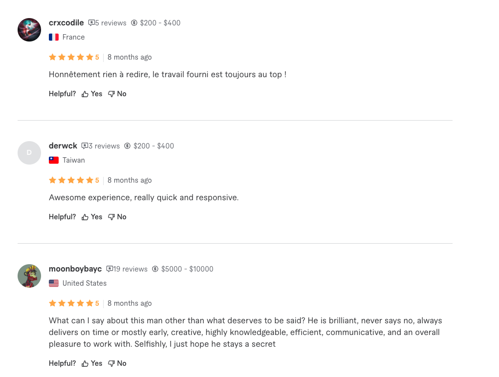

# Fiverr, How Much Should I Pay?

This chrome extension helps you find how much Fiverr sellers are charging other customers.

* On a seller side, this is useful so you know how much your buyers spend with other sellers.

* On a buyer side, this is useful when you receive an estimate from a seller so you know if they are used to charge that price to other buyers.

## How to use

1) Install the extension
2) Go to a seller's profile
3) Check the reviews

### Without F-HMSIP

### With F-HMSIP

